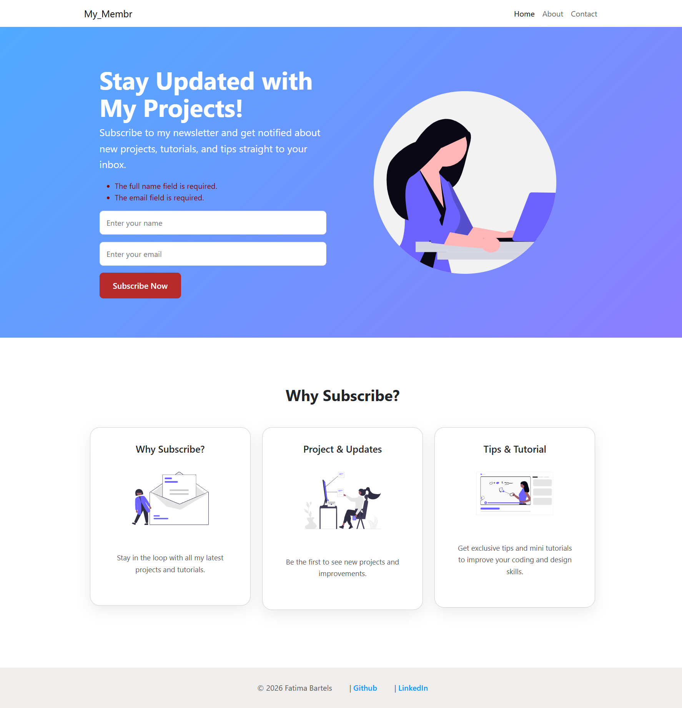

# My_Membr – Newsletter Subscription Landing Page (Laravel)

A clean and modern newsletter subscription landing page built with **Laravel**, focusing on best practices for MVC structure, Blade components, validation, and clean frontend architecture.



---

## ✨ Features

-   Full-width hero section with subscription form
-   Blade components for reusable UI elements
-   Form validation with user feedback
-   CSRF protection
-   Clean and minimal UI (custom CSS)
-   Responsive layout
-   Follows Laravel MVC conventions

---

## 🛠 Tech Stack

-   **Laravel 12**
-   **Blade Components**
-   **PHP 8**
-   **Custom CSS**
-   **Bootstrap (minimal usage for grid only)**
-   **MySQL**

---

## 📁 Project Structure Highlights

resources/
├── views/
│ ├── components/
│ │ ├── hero.blade.php
│ │ ├── feature-card.blade.php
│ │ └── subscription-form.blade.php
│ ├── layouts/
│ │ └── app.blade.php
│ ├── partials/
│ │ ├── header.blade.php
│ │ └── footer.blade.php
│ └── index.blade.php

## 🧠 What I Practiced in This Project

-   Laravel routing and controllers
-   Request validation
-   Eloquent models & mass assignment
-   Blade layouts and components
-   Component-based frontend architecture
-   Clean CSS styling without heavy frameworks

---

## 🚀 Getting Started

```bash
git clone https://github.com/FatimaBartels/membr.git
cd membr
composer install
php artisan key:generate
php artisan migrate
php artisan serve


📌 Future Improvements
Authentication (user login)

Email notifications

Admin dashboard for subscribers

API endpoints

Queue-based email sending

👩‍💻 Author
Fatima Bartels
Frontend / Full-stack Developer

GitHub: https://github.com/FatimaBartels

LinkedIn: https://www.linkedin.com/in/fatimabartels/

## 📝 License
This project is for educational purposes.
```
